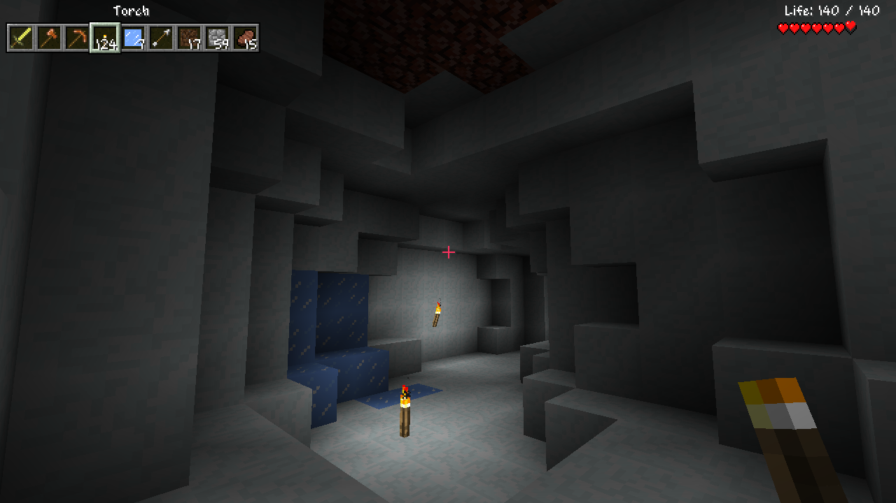

 

    

 

Betaria is a Minecraft Beta 1.7.3 mod that transforms the game into Terraria. Featuring a new appearance, new mechanics and new world generation, Betaria guarantees a Terraria-like experience.

*Want more Terraria-esque Minecraft mods? [Minecraft Diverge](https://github.com/BlueStaggo/MCDiverge) is inspired by Terraria!*

## Sound Setup
For custom audio to work properly in this mod, a valid copy of Terraria 1.4+ is required to extract assets from using [TExtract](https://forums.terraria.org/index.php?threads/textract-extract-terrarias-images-sound-effects-and-music.937/). The version of TExtract used must not have names for Journey's End tracks, in case such a version exists. In the `Content` folder, there is a `Wave Bank` folder and a `Sounds` folder. These two folders need to be copied to `.minecraft/resources` and renamed to `tmusic` and `tsound` respectively. If a warning does not appear upon playing this mod, the audio extraction was successful.

If TExtract hangs around on loading fonts, go to the folder where you installed Terraria (with Steam on Windows, this is `C:/Program Files (x86)/Steam/steamapps/common/Terraria`), move the `Fonts` folder out of the `Content` folder and try again.

Alongside this, there are a few custom tracks that can be added too as OGGs or WAVs:
- `Custom_DesertNight`: Plays at night in a desert
- `Custom_SnowNight`: Plays at night in a tundra or taiga

By clicking on the logo, the title music of the game can be changed between Journey's Beginning, Title Screen, Alt Title and Otherworldy Underground, with the latter option changing all of the game's music to the Terraria Otherworld soundtrack.

*Heh, only people who have played this game before can play this mod with working sound! [Unless...](https://youtu.be/i8ju_10NkGY)*

## Features
- Transformed many of the game's user interfaces
- Terraria's inventory and crafting system
- Terraria health mechanics, including health regeneration, potion sickness and life crystals
- Terraria-esque caves and biomes
- Expert mode difficulty in settings

## Screenshots

